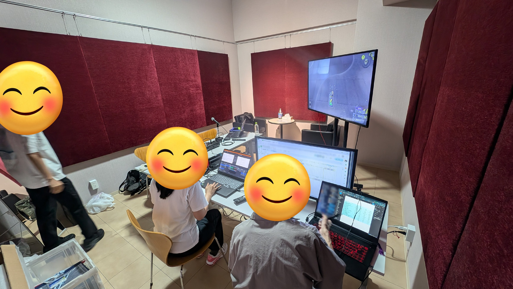

import { Tweet, YouTube, LinkPreview } from 'astro-embed';
import { Steps } from '@astrojs/starlight/components';

2024年8月31日に開催された「第5回TDU杯」にて、DENDAI e-sports で初めてとなるオフラインでの配信運営（選手はオンライン）を行っていました。  
その備忘録として準備～終了までの一連の流れを書き留めておこうと思います。

<Tweet id="https://x.com/kazuemon_0602/status/1829555822042722406" />

## 検討編

### そもそもオフラインでの運営にした理由

これまで DENDAI e-sports の配信運営は概ねオンラインでやることが多く、過去に私が実況でも入っていた「[千住・鳩山対抗戦](https://www.youtube.com/watch?v=UTXWIWcwTFQ)」「[芝電対抗戦](https://www.youtube.com/watch?v=6jLZ0FUhkMk)」「[第4回TDU杯](https://www.youtube.com/watch?v=u2I3kp8X5mI)」は**全て自宅でオペレーション**を行っていました。

しかし、私含めた21生の卒業が近づき、**そろそろ団体として後輩に引き継ぎをしなければならない時期**になり、その中でどのように技術を受け継いでいくか、経験を積んでもらうかが大きな課題となり、それを受けて**次の大会運営は後輩にも入ってもらう方向**で準備を進めていました。  
（先述の大会は配信画面設計などの準備も含めて全てほぼ私だけでやっていましたので…）

ただ、配信オペレーションをリモートで教えながらやっていくとなると、画面上の場所を示したり、キャスター側とタイミングを合わせたりといった連携が非常に難しく、ならばオフラインで大会運営をやろう、ということになりました。

### オフラインでの運営場所の選定

ていうわけでオフラインでやろうとなったわけですが、オフラインでの運営では以下のモノが揃っている場所を用意する必要があります。

- 配信に使えるパソコン
  - エンコードがちゃんとできる**それなりにスペックの良い**パソコン（ノートを持ち込むのも可）
- 配信に耐えうるインターネット回線
  - それなりに安定していて、**特に上り速度がある程度出る**こと
- **音を出しても怒られない部屋**
  - 特にキャスターも含めてオフラインで運営を行う場合は、周囲に迷惑にならないような場所が必要

以上を踏まえた候補は以下の4つでした。

| 候補 | メリット | デメリット |
| --- | --- | --- |
| **自宅に集まってもらう** | <ul><li>配信環境の準備は全て整えられている</li></ul> | <ul><li>辺境の地にあるので集まってもらうのが大変</li><li>夜におおきな声は出せない</li></ul> |
| **大学の教室を借りる** | <ul><li>レンタル料金はかからない</li></ul> | <ul><li>22時で閉まってしまうので**深夜の運営ができない**</li></ul> |
| **レンタルスペースを借りる** | <ul><li>スタジオと比べると料金が安い</li></ul> | <ul><li>回線や防音には不安が残る</li></ul> |
| **スタジオを借りる** | <ul><li>回線や防音などの設備は申し分ない</li></ul> | <ul><li>**レンタル料金がそれなりにかかる**</li></ul> |

上記の比較において「**深夜の運営ができない**」「**レンタル料金がかかる**」というのは**非常にクリティカルな要素**でした。

大会は**選手が参加しやすいように19時ごろからスタート**するため、配信を22時までに片付けまで含めて終わらせるのは難しく、この時点で**大学は候補から外れる**こととなりました。  
その一方で、スタジオを借りるとなるとそれなりにレンタル料金がかかることが想定されたため、あくまでも自宅を最終手段としつつ、**スタジオでの運営を想定して準備を進めていくこととしました**。

## 準備編

### 当日のおおまかなスケジュール決定

当日の配信開始時間を踏まえて、何時から準備をして…といったスケジュールを最初に決めました。

- 16時: 集合・準備開始
- 19時: 配信開始
- 22時: 配信終了
- 23時: 片付け終了・解散

配信ソフト側の準備は前日準備で終わらせておくことで、機材の配線などのみに集中できるようにしました。

### 配信に関わる人員のスケジュール確保

Discord の投票機能などを用いて前日準備と当日の運営に入れるメンバーを確認しつつ、最終的に本大会では**解説（同期）、実況（私）、オペ担当（後輩）、オペ補佐（同期）の4名で集まって運営を行う**ということになりました。

集まる時間ですが、キャスターはある程度時間ギリギリでも何とかなりますが、**オペレーションスタッフはできれば終日空いていることが望ましい**と思います。交通状況を踏まえて早く集合になったり、時間が伸びたりする可能性もあるからです。

どちらかというと**解散時間の方が重要で、終電の時間なども踏まえて何時まで居られるかも確認しておくと良い**かと思います。  
私自身は次の日の朝に新幹線で遠出する用事があったため同期のメンバーとホテルを取ったので時間を考える必要はありませんでしたが、**スタッフの何人かは門限があった**ため、終了時間にはかなり注意を張っていました。

### スタジオの確保

先ほどの検討も踏まえ、以下の要件でそこらじゅうのスタジオを選定し、今回は「[芝浦海岸リマニK3スタジオ](https://www.limani.studio/)」さんの202スタジオを借りることにしました。

- インターネット回線が用意されていること
  - Web サイト上の記載と電話口にてインターネット回線が完備されていることを確認
- 料金がリーズナブルであること
  - **7時間でのレンタルで2万円以内でした**。本当に助かりました。
- 23時まで利用できること
  - ただし23時以降は別料金枠となるとのことでした
- メンバーからのアクセスが良い場所であること
  - ゆりかもめ芝浦ふ頭駅から徒歩10分、JR田町駅から徒歩15分

申し込みの手順としては以下のように進みました。

<Steps>
1. 電話口での問い合わせ（不明点の確認）
1. 見積もりをメールで送ってもらう
1. 仮押さえの連絡
1. 正式な申し込みを行う旨を連絡
1. 送られてきた必要な書類に記入して返信
1. 代金を振り込み
1. 当日の流れを確認
</Steps>

団体から予算が出せないため、今回は個人としてレンタルしました。  

### 必要な機材の準備

まずは配信に必要な機材をピックアップしていきます。今回は書かなかったですが、本当は配線図を書いていくのが良いです。記事用の配線図を後ほど掲載しています。

- 配信用PC
  - 今回はノートパソコンを持ち込み
- モニター
  - 配信ソフトなどを出すオペレーター用
  - ゲーム画面を出す演者（キャスター）用
- 映像
  - キャプチャーボード
  - HDMI ケーブル
- Switch
  - 本体
  - ドック
  - 有線LANアダプタ
- 音響
  - オーディオインターフェース（ミキサー）
  - マイク
    - キャスターの人数分必要
  - マイクスタンド
    - 床に置くタイプや卓上タイプなど色々アリ
  - XLR ケーブル
    - マイク等を繋ぐケーブルのことです
- ネット関係
  - LAN ケーブル
  - LAN ハブ
    - 雑に言うと LAN ポートを増やすやつ
- その他
  - 電源延長ケーブル
  - 電源タップ

必要な機材を書き出せたら、調達手段を考えます。

- 大学の放送委員会からレンタル
  - 色々機材持ってるので今後もよかったら借りてください（元委員長でした）
- 個人の持ち込み機材
  - Switch などの機材は個人で持っていきました
- スタジオの備え付け機材
  - モニターなどの大物は極力スタジオで借りるのが吉

今回借りたスタジオは[パック](https://www.limani.studio/?id=784)を選んで追加料金なしで機材が借りられたので、モニターなどの大物機材はすべてスタジオの物を使用しました。ケーブルに関しては一覧に無かったため、メールで確認して借りられる本数を確認しました。

ケーブルの長さとかは部屋の大きさによっても変わるため、部屋の寸法やコンセントの配置なども事前に確認しておくと良いです。

**当日に不足が発覚したり、機材が混ざったりするとマズい**ので、準備・片付け用に機材リストを作成しておくと良いです。  
私は他のメンバーとも簡単に共有できるようにだいたい Google スプレッドシートで作ってます。

:::tip
特に**ケーブルなどは本数不足や突然の故障、長さが足りなくなることがよくあります**。いざというときのために、スタジオ周辺で購入できる場所を探しておくのもおすすめです。
:::

### 機材運搬の準備

今回は3箇所の機材が結集するので、**機材が混ざらないように細心の注意を払う必要があります。**  
片付け時に区別できるように、個人の持ち込み機材と委員会のレンタル機材にはあらかじめそれぞれ違う色の**マスキングテープを貼ってから配線**しました。

:::caution
大前提ですが、ケーブルなどにシールなどを貼っていいかはちゃんと確認してくださいね。
:::

また、今回機材を持ってくる時は全く問題が無かったのですが、**私が次の日の朝イチで新幹線に乗り東京を離れなければならないという異常な状態**であったため、本番終了後に機材をどこに置いておくのか、いつ返却するかに結構悩みました。

スタジオ側に荷物を置かせてもらえないか相談したり、短期間のレンタルスペースを借りて置けないか検討したりしましたが、最終的にはメンバーに分担して持って帰ってもらい、私が東京に帰ってきたタイミングで大学に持ってきてもらう形になりました。自分の管理が及ばない範囲に機材が置かれることによる運搬中や保管中の紛失・故障などのリスクは十分承知の上でこのような形をとりました。

### 前日準備

大会前日は大学に集まって作業会を開きました。

- 配信画面デザインを完成させる
- 配信機材のピックアップ
- 配信ソフトの設定
- 簡単なオペレーションの段取りの確認
- 当日の流れの確認

**過去の大会は自分で進行もオペもやっていたのでほぼ台本なしでやっていた**のですが、流石に今回は簡単な配信進行表を作りました。台本を一字一句書く時間はなかったので、私の言葉をトリガーにして画面を切り替えてもらう形にしました。

準備の帰りの時、道が冠水するレベルの土砂降りの雨で「明日大丈夫か…」となっておりましたが、後に苦しむことになります。

## 当日編

私は相模原に住んでいるんですが、前日、雨やべーなと思っていたら…

京王線は橋本から出られない…

<LinkPreview id="https://www3.nhk.or.jp/news/html/20240830/k10014565161000.html" />

JR に乗って小田急で行こうと思ったら直通停止してるしほぼ徐行運転…

<LinkPreview id="https://trafficnews.jp/post/134686" />

最寄り駅から東京に出る手段がほぼ壊滅し、準備開始時間が大幅に遅れることになりました。

### 機材運搬

まずは大学に行って1人と合流し、手分けして機材をスタジオまで運搬します。  
16時からスタジオを借りていたのですが、スタジオに到着した時点で17時という、リハーサルをするには絶望な時間に…（ちゃんとスタジオの担当者さんには電話で遅れる旨を連絡しました）

### 機材セッティング

配線図を作成していませんでしたが、そもそも事前にどのケーブルがどれみたいな話はほとんどしていなかったので、私の簡単な説明と指示の元でケーブルを配線してもらいました。

一応記事用に書き出した配線図はこんな感じです。

オペレーション簡素化のために、キャスター側のマイクはキャスター側でミキシングを行い、配信オペレーターは配信ソフト上で配信出力の音声を聴きながらゲーム音声とマイク音声のバランスを調整してもらう形をとりました。

セッティングの全景はこんな感じです。  
演者向けのモニターはキャプチャーボードのパススルーが写っています。

### リハーサル

機材セッティングがずれ込んだため、ほぼリハーサルなしで挑むことになりました。

### 本番

本番では特にトラブルはなく進行しました。是非本編もご覧ください。

<YouTube id="https://www.youtube.com/watch?v=HZj64RZyp2Q" />

接戦の末に勝者が決定し、**予定より大幅に送れた 22:43 から片付けが開始**しました。**ヤバい**。

<video controls>
  <source src="https://video.twimg.com/ext_tw_video/1829555780552638464/pu/vid/avc1/1278x720/3drE9UkXDomjRrw5.mp4" />
</video>

### 後片付け

とはいえ私を舐めることなかれ。数々の現場を経験してきた私を持ってすれば15分での片付けは問題なし（ではありません。）

片付けの段取りは以下のように進めました。

<Steps>
1. 各種機材の電源を落とす
    :::tip
    先に電源を落として、抜くとダメなケーブル等の区別をしなくていいようにすると良いです
    :::
1. 手分けしてケーブルを抜き、**マスキングテープに応じて振り分け**
1. 私は順次機材リストを元に収納
    - 責任者は確認に回ると良いです
1. 収納できた機材から順次運び出し
1. 最後にスタジオから借りた機材を再チェック
    - スタジオから借りた機材さえ整っていれば委員会の機材と私物の機材は混ざっていても一旦大丈夫。
</Steps>

最後にスタジオのスタッフさんにもチェックしていただき、無事に23時までに片付けを終えることができました。  
どうやらスタジオのスタッフさんがバックヤードで配信を観てくださっていたようで、凄かったですねとのお声を頂きました、嬉しいですね。

## 振り返り

後日、振り返り会を行いました。

- **良かったところ**
  - オフラインだから**アイコンタクトや身振り手振りで連携できた**
  - 説明がわかりやすかったので、初心者でも参加しやすかった
  - **現地運営側の問題で進行や試合が止まることがなかった**
  - **モニター役と配信オペを分けることができた**
  - **配信と実況を分担していたおかげで進行がスムーズに行えた**
  - 集まって作業したのでオンラインよりも集中してすすめることができた
  - 配信のクオリティが高かった
- **改善した方が良い点**
  - **キャスターとオンライン運営メンバーの意思疎通が難しかった**
    - 自宅から運営に参加しているメンバーからの連絡に気づけなかった
    - 専用のチャットを別で作るべきだったかも
  - **チーム名の表記ブレがあった**
    - 基本コピペで書くようにしよう
  - **宣伝とかデザインとかもう少し早く動き出すべきだった**
  - 配信に映っていない卓の結果集計が大変だった
  - 機材運搬がずれこんで、配信オペレーションのリハーサルがしっかりできなかった
  - もっと色んな試合を映したかった
  - **次回以降も時間内に終われるか不安が残る**

## さいごに

今回は初のオフライン大会運営に挑戦してみたわけですが、やはりやりやすさを手に入れるための会場の確保や機材の調達が大きな課題だと感じました。

オンラインであれば配信オペレーションを機材が揃っているメンバーに完全に任せるのが一番楽な方法ではあり、属人化を防ぐために複数人でオペレーションを分担したいモチベがあるものの、予算がないと資金的にオフライン運営は厳しいですね…

最後に、今回運営に参加してくれたメンバー、そして出場した選手に感謝です🙏